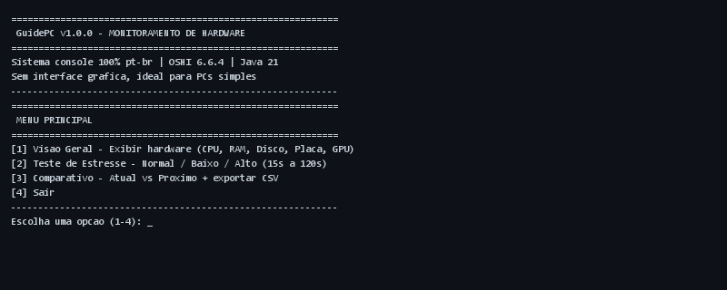
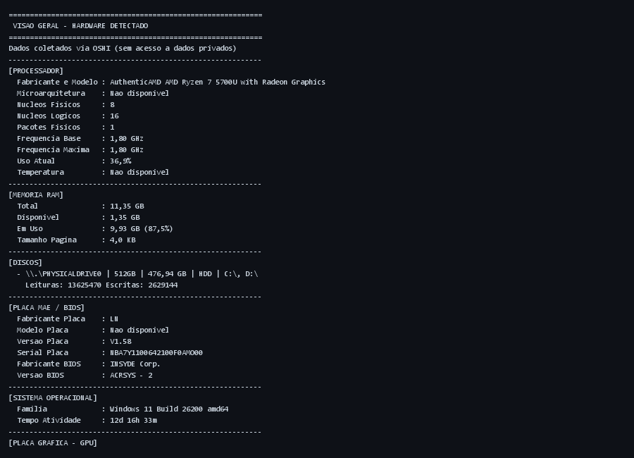
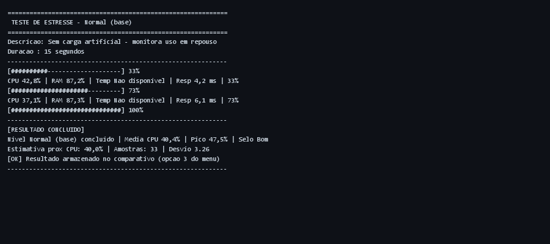
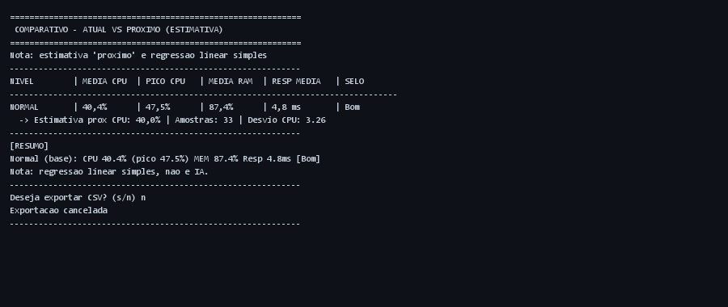

# GuidePC - Monitoramento e Teste de Hardware

Sistema em Java 21 que lê seu hardware de verdade, faz teste de estresse e compara os resultados. Tudo no console, sem janela, sem peso — feito pra rodar até em PC fraco.

> Dica: no Windows use `chcp 65001` ou abra no VS Code/GitHub se os acentos bugarem.

## Índice
1. [O que faz](#1-o-que-faz)
2. [Por que só console?](#2-por-que-so-console)
3. [Pra que teste de estresse?](#3-pra-que-teste-de-estresse)
4. [Como o projeto está organizado](#4-como-o-projeto-esta-organizado)
5. [Tecnologias e ferramentas](#5-tecnologias-e-ferramentas)
6. [O que é OSHI?](#6-o-que-e-oshi)
7. [Requisitos](#7-requisitos)
8. [Como rodar](#8-como-rodar)
9. [Como usar](#9-como-usar)
10. [Prints reais](#10-prints-reais)
11. [Problemas comuns](#11-problemas-comuns)
12. [O que vem por aí](#12-o-que-vem-por-ai)

---

## 1. O que faz

O GuidePC pega informações do seu hardware (CPU, RAM, disco, placa-mãe, BIOS, sistema e GPU) usando OSHI — nada de dado pessoal, só hardware mesmo.

Depois roda testes em 3 níveis diferentes e no final te mostra um comparativo com média, pico, desvio e até uma estimativa do próximo resultado. Dá pra exportar em CSV e PDF (backup físico em `relatorios/`).

Nessa versão 2.1:
- Leitura completa via OSHI (funciona em Windows/Linux/macOS)
- Teste de CPU/memória com métricas ao vivo
- Comparativo no console + exportação CSV e PDF local
- PDF com data/hora da coleta e usuário logado — pronto para imprimir/entregar
- Código revisado, sem gambiarras, com comentários objetivos

O que NÃO faz (por enquanto): mexer em overclock, testar GPU pesado ou mandar dado pra nuvem.

## 2. Por que só console?

Porque a ideia é rodar em qualquer PC, até aquele com 4GB de RAM da escola ou laboratório.

| Console (como o GuidePC é) | Com interface gráfica (JavaFX/Swing) |
|---|---|
| Jar de ~6 MB, abre em menos de 1s, usa ~60-80 MB | Jar de 14 MB+, abre em 3-5s, pede 150-300 MB e placa de vídeo |
| Roda só com `java -jar`, sem frescura | Precisa de `module-path`, JavaFX e driver de vídeo |
| Funciona até por SSH, sem monitor | Precisa de tela, não roda em servidor |

Na prática tiramos JavaFX/FXML e ficamos só com `System.out`, `Scanner` e `ExecutorService`. Qualquer PC com JDK 21 roda.

## 3. Pra que teste de estresse?

Pra saber se a máquina aguenta e pra comparar desempenho sem depender de benchmark externo.

| Nível | O que faz | Quando usar |
|---|---|---|
| **Normal** | Só monitora, sem carga | Serve de base pra comparar |
| **Baixo** | Usa 50% dos núcleos com conta matemática (`sin/cos/sqrt`) | Simula uso do dia a dia, navegador, escritório |
| **Alto** | Usa 100% dos núcleos + ocupa até 60% da RAM livre (limite 2GB) | Testa resfriamento e limite da máquina |

A cada 500ms coleta:
- Uso de CPU e RAM (%)
- Frequência da CPU
- Temperatura (se tiver sensor)
- Tempo de resposta do benchmark interno (ms)

No final calcula média, pico, mínimo, desvio padrão e chuta o próximo valor de CPU com regressão linear simples. Classifica como `Bom` (<60% CPU e <5ms), `Regular` (<85% e <15ms) ou `Crítico`.

## 4. Como o projeto está organizado

MVC adaptado pra console, tudo em pt-br:

```
GuidePC/
├── pom.xml
├── run.bat                          # atalho pra java -jar target/guidepc-2.1.jar
├── relatorios/                      # PDFs/CSVs gerados (backup físico, ignorado no git)
└── src/main/java/com/guidepc/
    ├── Principal.java               # menu principal
    ├── modelo/
    │   ├── InformacoesHardware.java
    │   ├── InformacoesProcessador.java
    │   ├── InformacoesMemoria.java
    │   ├── InformacoesDisco.java
    │   ├── InformacoesPlacaMae.java
    │   ├── InformacoesSistemaOperacional.java
    │   ├── NivelEstresse.java       # NORMAL / BAIXO / ALTO
    │   ├── Amostra.java
    │   └── ResultadoTesteEstresse.java
    ├── servico/
    │   ├── ServicoColetorHardware.java
    │   ├── ServicoTesteEstresse.java
    │   ├── ServicoComparacao.java
    │   ├── ExportadorCsv.java       # gera CSV para relatorios/
    │   └── ExportadorPdf.java       # gera PDF com data/hora + usuário
    ├── visao/
    │   ├── VisaoConsole.java
    │   ├── VisaoGeralConsole.java
    │   ├── VisaoTesteEstresseConsole.java
    │   └── VisaoComparativoConsole.java
    ├── controlador/
    │   ├── Comando.java
    │   ├── ComandoVisaoGeral.java
    │   ├── ComandoTesteEstresse.java
    │   ├── ComandoComparativo.java  # menu CSV/PDF/Ambos
    │   ├── ComandoSair.java
    │   └── ComandoInvalido.java
    └── utilitario/
        ├── Formatador.java
        └── NomeArquivo.java         # gera nome com data + usuário sanitizado
```

Quer mexer? Adiciona campo no `modelo`, ajusta o `ServicoColetorHardware` e atualiza a `VisaoGeralConsole`.

## 5. Tecnologias e ferramentas

| Camada | Ferramenta | Versão | Pra que serve |
|---|---|---|---|
| Linguagem | Java (Temurin) | 21 | Base do projeto, `release 21` no `pom.xml` |
| Coleta de hardware | OSHI | 6.6.4 | Lê CPU, RAM, discos, placa-mãe e sensores (ver §6) |
| Acesso nativo | JNA + JNA Platform | 5.15.0 | Ponte que o OSHI usa pra chamar APIs do SO (WMI, /proc, IOKit) |
| Relatório PDF | OpenPDF | 1.3.35 | Gera PDF local em `relatorios/` com tabela e metadados |
| Log | SLF4J Simple | 2.0.16 | Log leve; mostra `warn` do OSHI quando sensor não existe |
| Build | Maven + Shade Plugin | 3.9+ / 3.6.0 | Compila e gera `guidepc-2.1.jar` fat com `Main-Class` |
| Teste | JUnit Jupiter | 5.11.0 | Testes em `src/test/java` (`FormatadorTeste`, `ServicoComparacaoTeste`) |
| Execução | `run.bat` | — | Atalho Windows que faz `chcp 65001` e roda o jar |

> Todas as versões estão fixadas em `pom.xml` (`oshi.versao`, `jna.versao`, `openpdf.versao` etc.) pra build reprodutível.

## 6. O que é OSHI?

**OSHI (Operating System and Hardware Information)** é uma biblioteca Java open-source que abstrai a leitura de hardware e sistema operacional.

Sem ela você teria que escrever JNI/C e chamar APIs diferentes por SO:
- **Windows:** WMI / Win32 API (`MSAcpi_ThermalZoneTemperature`, `Win32_Processor`)
- **Linux:** `/proc/cpuinfo`, `/proc/meminfo`, `/sys/class/thermal`
- **macOS:** IOKit / sysctl

O OSHI já faz isso e expõe tudo em Java puro via `SystemInfo` e `HardwareAbstractionLayer`:

```java
SystemInfo si = new SystemInfo();
HardwareAbstractionLayer hal = si.getHardware();
hal.getProcessor().getSystemCpuLoadTicks(); // ticks pra calcular % CPU
hal.getMemory().getAvailable();             // RAM livre
hal.getDiskStores();                        // discos + SMART
hal.getSensors().getCpuTemperature();       // sensor se houver
```

**Por que escolhemos OSHI no GuidePC:**
- Cross-plataforma sem código nativo próprio.
- Já integra com JNA (não precisa JNI manual).
- Usado em `ServicoColetorHardware` como singleton sincronizado — o HAL não é thread-safe, por isso todo acesso é `synchronized`.
- Devolve `Double.NaN` / `0` quando sensor não existe — tratamos com `Formatador` exibindo “Nao disponivel”.

Site: https://github.com/oshi/oshi — licença MIT.

## 7. Requisitos

- JDK 21 (`java -version` pra conferir)
- Maven 3.9+ (só se for compilar)
- 100 MB livres, Windows/Linux/macOS

## 8. Como rodar

```bat
# clonar
git clone https://github.com/Nitr0-Zeus/GuidePC.git
cd GuidePC

# compilar
mvn clean package -DskipTests

# rodar (recomendado)
java -jar target/guidepc-2.1.jar
# ou só clicar/duplo clique em
run.bat
```

`run.bat` já faz o `chcp 65001` pra acento não bugar:
```bat
@echo off
chcp 65001 >nul
java -jar target\guidepc-2.1.jar
```

Pra rodar os testes:
```bat
mvn test
```

## 9. Como usar

### Menu principal
```
============================================================
 GuidePC v2.1 - MONITORAMENTO DE HARDWARE
============================================================
[1] Visão Geral - Exibir hardware (CPU, RAM, Disco, Placa, GPU)
[2] Teste de Estresse - Normal / Baixo / Alto (15s a 120s)
[3] Comparativo - Atual vs Próximo + exportar CSV/PDF (relatorios/)
[4] Sair
Escolha uma opcao (1-4):
```

### Opção 1 - Visão Geral
Mostra tudo: fabricante/modelo da CPU, núcleos, frequência, uso e temperatura; RAM total/livre; discos (já diz se é HDD/SSD/NVMe); placa-mãe/BIOS; sistema e tempo ligado; GPUs. Aperta `ENTER` pra voltar.

### Opção 2 - Teste de Estresse
1. Escolhe o nível: `1` Normal, `2` Baixo, `3` Alto
2. Escolhe duração: `1` 15s, `2` 30s, `3` 60s, `4` 120s
3. Acompanha ao vivo:
   ```
   [##########--------------------] 33%
   CPU 42,8% | RAM 87,2% | Temp Nao disponivel | Resp 4,2 ms | 33%
   ```
4. No final salva pro comparativo. Quer parar antes? `Ctrl+C`.

Segurança: no nível Alto ele só aloca até 60% da RAM livre e no máximo 2GB. Se ficar com menos de 200MB livres, solta metade e faz `GC`.

### Opção 3 - Comparativo
Mostra tabela no console e oferece backup físico:
```
NIVEL        | MEDIA CPU  | PICO CPU   | MEDIA RAM  | RESP MEDIA   | SELO
NORMAL       | 40,4%      | 47,5%      | 87,4%      | 4,8 ms       | Bom
  -> Estimativa prox CPU: 40,0% | Amostras: 33 | Desvio CPU: 3.26
```
E resumo tipo `Normal->Alto +X%`. Depois pergunta:
```
Exportar relatório (backup físico em relatorios/):
  [1] CSV   [2] PDF   [3] Ambos   [4] Cancelar
Escolha (1-4) [3]:
```
Isso gera em `relatorios/` (pasta na raiz, ignorada no git):
```
relatorios/guidepc_relatorio_2026-08-27_15-30-22_Joao.pdf  # inclui data/hora + usuário logado + dados da máquina
relatorios/guidepc_relatorio_2026-08-27_15-30-22_Joao.csv
```
O PDF já vem com cabeçalho (GuidePC v2.1, data/hora da geração, usuário@host, SO/CPU), tabela comparativa e resumo — pronto para imprimir.

### Opção 4 - Sair
Fecha e libera as threads. Se rodar com entrada redirecionada e fechar, sai sozinho com `Entrada encerrada, saindo...`.

## 10. Prints reais

Tirados aqui mesmo — Ryzen 7 5700U, 11,35 GB, Windows 11, console puro:

### Menu Principal


### Visão Geral

<details><summary>Texto copiável</summary>

```
[PROCESSADOR]
  Fabricante e Modelo : AuthenticAMD AMD Ryzen 7 5700U with Radeon Graphics
  Nucleos Fisicos     : 8
  Nucleos Logicos     : 16
  Uso Atual           : 36,9%
[MEMORIA RAM]
  Total               : 11,35 GB
  Disponivel          : 1,35 GB
```
</details>

### Teste de Estresse (15s NORMAL)


### Comparativo


## 11. Problemas comuns

| O que aparece | Por que | O que fazer |
|---|---|---|
| `Temperatura: Nao disponivel` | Sem sensor/driver ou sem permissão de admin | Normal no Windows, não atrapalha o teste |
| `MSAcpi_ThermalZoneTemperature` warn | OSHI tenta WMI que não existe | Só ignorar (log do SLF4J) |
| `Nenhum disco detectado` | Sem permissão pro SMART | Roda como administrador se precisar do serial |
| `OutOfMemoryError` no Alto | Bateu no limite | Ele solta metade da memória e continua |
| Acento com `?` | Console sem UTF-8 | Usa o `run.bat` que já faz `chcp 65001` |
| `relatorios/` vazio | Ainda não exportou | Use opção 3 e escolha [1/2/3] |

## 12. O que vem por aí

- v1.0: console, 3 níveis, CSV (entregue)
- v2.0: docs de ferramentas, explica OSHI, código limpo (entregue)
- **v2.1: exportação PDF local com data/hora + usuário, pasta `relatorios/` (atual)**
- v2.2: teste de disco, gráfico no PDF, histórico filtrável
